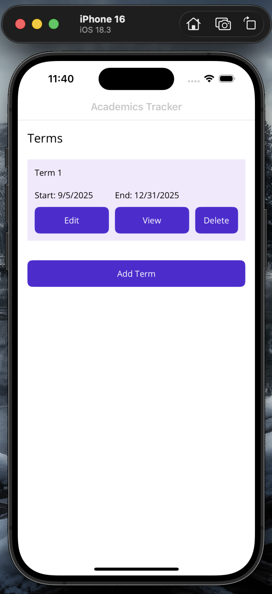
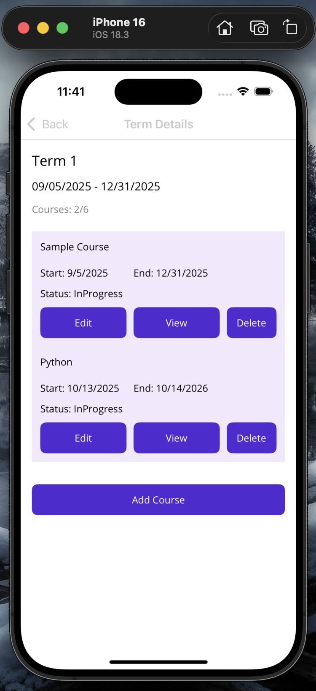
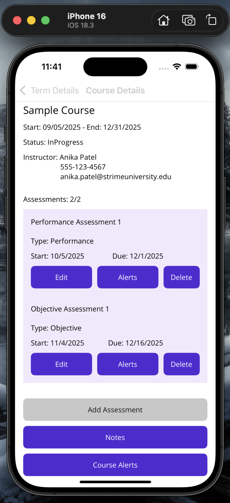

# Academics Tracker (MAUI App)
This is a mobile application built with NET Multi-platform App UI (MAUI) framework.

> **Note:**
> The scenario, project idea, and chosen technologies (framework) all originate from my course at the university.
> My task is to completely build the project from the gathered requirements, and pass the evaluation. 

#### Scenario:
The school requires an application that allows students to enter, edit, and delete term, course, and assessment data. 
It should provide detailed views of courses for each term, 
provide notifications for upcoming performance and objective assessments.

#### Additional Note:
1. This application was using **Visual Studio 2022** on a **Windows 11 (Virtual Machine)** via **Parallels Desktop** on a **Macbook**. (Tested on Macbook's Rider IDE.)

#### Technologies Used:
- **C#**, **MAUI (.NET 8.0)**, and **sqlite-net**.

 

## Features
- XAML
- Plugin.LocalNotification  library
- Local database (SQLite)

#### In-App Features:
- View/Add/Edit/Delete Terms
- View/Add/Edit/Delete Courses
- Add alerts for upcoming or due dates for courses, assessments
- Add Notes for a specific course

 

## Wireframe 

 

## Screenshots
| Home Screen                                                 | Term Details                                                 | Course Details                                                 |
|-------------------------------------------------------------|--------------------------------------------------------------|----------------------------------------------------------------|
|  |  |  |

### Author
Tonyruizo

